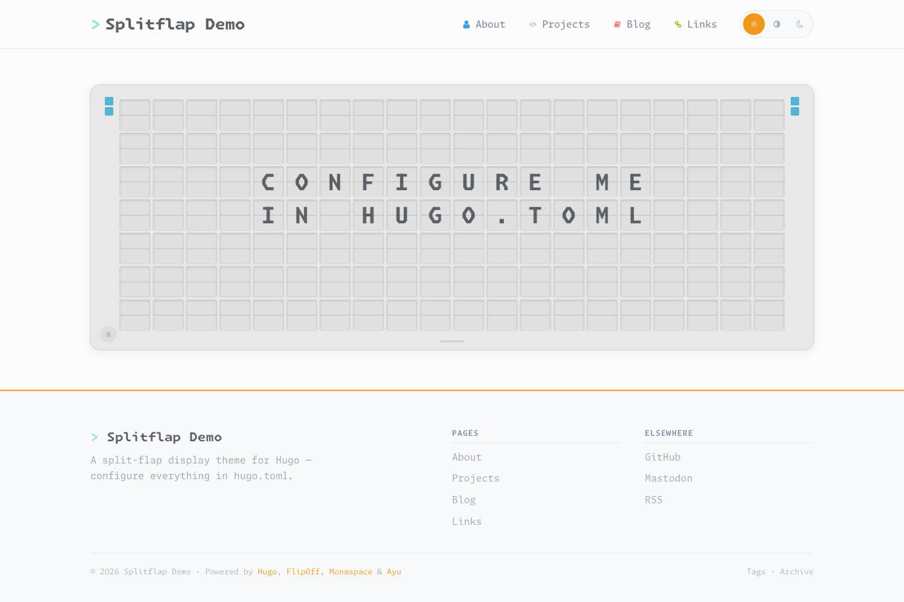

# Splitflap

A Hugo theme built around an animated split-flap display ("Fallblattanzeige") —
the classic mechanical departure-board look as a landing page, paired with an
editorial content style, Ayu colors and Monaspace typography.

**Demo:** [hnsstrk.de](https://hnsstrk.de/)



## Features

- **Split-flap landing page** — animated board with scramble effect, message
  rotation and keyboard controls (adapted from
  [FlipOff](https://github.com/magnum6actual/flipoff))
- **Three color themes** — Ayu Light, Mirage and Dark, switchable at runtime,
  with system-preference detection (light default renders first; the stored
  theme is applied on `DOMContentLoaded`)
- **Monaspace typography** — all five Monaspace variants bundled as variable
  fonts, plus Nerd Font icon variants (no SVG icons)
- **Mermaid diagrams** — self-hosted, loaded only on pages that use them,
  re-themed live on theme switch
- **Editorial content layouts** — blog with archive, projects, links and
  about pages; TOC, callout and TL;DR shortcodes
- **Hardened by default** — CSP-friendly asset pipeline with subresource
  integrity, `rel="noopener noreferrer"` on external links, strict Mermaid
  security level

## Requirements

- Hugo **extended** ≥ 0.158.0 (requires `site.Language.Locale`)

## Installation

### Option A — Git submodule (recommended)

```bash
git submodule add https://github.com/hnsstrk/splitflap.git themes/splitflap
echo 'theme = "splitflap"' >> hugo.toml
```

> **Note for CI/server builds:** make sure your build checks out submodules
> (`git submodule update --init`).

### Option B — Hugo Modules

```bash
hugo mod init github.com/yourname/yoursite
```

Then add to `hugo.toml`:

```toml
[module]
  [[module.imports]]
    path = "github.com/hnsstrk/splitflap"
```

> The theme has no module dependencies of its own, so it ships without a
> `go.sum` — no `hugo mod tidy` is required on the consumer side.

## Configuration

Minimal `hugo.toml`:

```toml
baseURL = "https://example.org/"
locale = "de"
title = "Your Name"
theme = "splitflap"

[params]
  description = "Your site description"
  author = "Your Name"          # also used as avatar alt text on the about page
  tagline = "Optional footer tagline"
  logoPrompt = ">"              # prompt character before the site title
  avatar = "images/avatar.png"  # about-page portrait, relative to static/
  ogLocale = "de_DE"            # og:locale meta tag (default: de_DE)
  # ogImage = "images/og.png"   # fallback Open Graph image — provide your own
  # contentLicense = "CC BY 4.0"      # optional footer license segment
  # contentLicenseUrl = "/licenses/"  # optional link target for the license

  [params.social]               # rendered in footer + JSON-LD sameAs
    github = "yourhandle"
    mastodon = "@yourhandle"
    # bluesky = "yourhandle"
    # linkedin = "yourhandle"

  # Default color theme on first visit — "light" | "mirage" | "dark" (default: "light").
  defaultTheme = "light"

  # Mastodon social link — accepts either a bare handle "@user" (resolved to
  # mastodon.social/@user) or a full URL "https://fosstodon.org/@user".
  [params.social]
    mastodon = "@yourhandle"

  # Split-flap board messages on the landing page. Each message is an array
  # of up to 7 lines, max. 20 characters each (A-Z, 0-9, .,-!?'/: and space).
  # Omit to get the theme's default demo messages.
  [params.board]
    messages = [
      ['', '', 'HELLO WORLD', '', 'SPLITFLAP', '', ''],
      ['', '', 'CONFIGURE ME', 'IN HUGO.TOML', '', '', '']
    ]

# Pagination — controls how many posts appear per blog list page.
# [pagination]
#   pagerSize = 20

[menus]
  [[menus.main]]
    name = "Blog"
    url = "/blog/"
    weight = 10
    [menus.main.params]
      icon = "f02d"             # Nerd Font codepoint
```

A fully commented configuration ships with the `exampleSite/`.

## License

[MIT](LICENSE) — © 2026 [hnsstrk.de](https://hnsstrk.de).

This theme bundles and adapts third-party work. Full license texts in
[THIRD-PARTY-LICENSES.md](THIRD-PARTY-LICENSES.md):

| Component | License |
|---|---|
| [FlipOff](https://github.com/magnum6actual/flipoff) — split-flap JS (adapted) | MIT |
| [Monaspace](https://github.com/githubnext/monaspace) — fonts (bundled) | OFL-1.1 |
| [Nerd Fonts](https://github.com/ryanoasis/nerd-fonts) — icon patching | MIT |
| [Mermaid.js](https://github.com/mermaid-js/mermaid) — diagrams (bundled) | MIT |
| [Ayu](https://github.com/ayu-theme/ayu-colors) — color palettes | MIT |

If you use this theme, a link back to this repository is appreciated — not
required.
