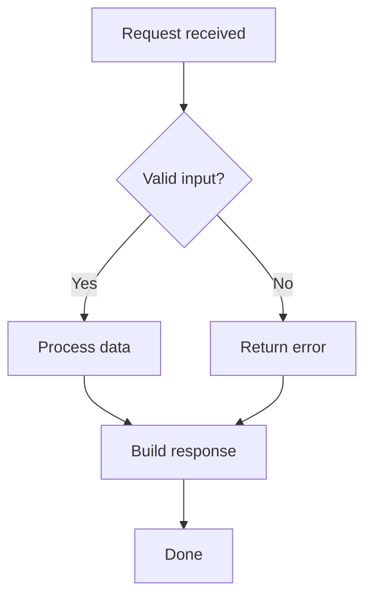
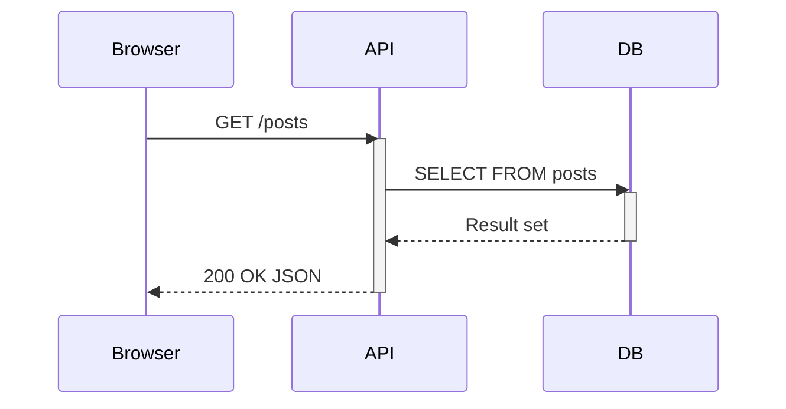
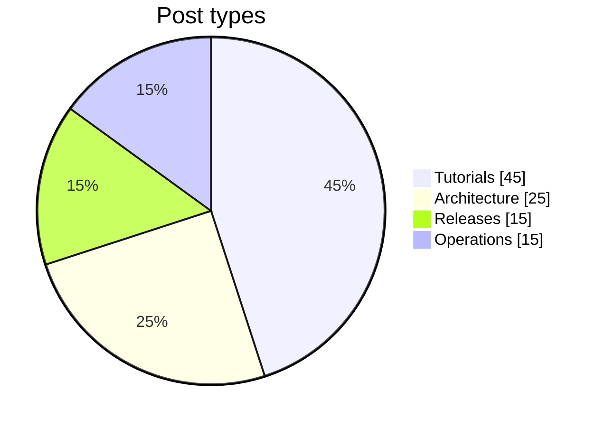

The theme loads Mermaid only on pages that contain at least one `mermaid` code block. Diagrams are re-rendered automatically when the visitor switches between Light, Mirage, and Dark — colors always match the active Ayu theme.

<!--more-->


Use standard fenced code blocks with the `mermaid` language tag. No shortcodes, no extra config — just write the diagram and Hugo handles the rest.


## How it works

A Hugo render hook detects `mermaid` code blocks and sets a page-level flag (`hasMermaid`). The base template loads `mermaid.min.js` only when that flag is set, keeping every other page free of the library.

The theme configures Mermaid with `securityLevel: strict` and a custom `base` theme that maps the eight Ayu syntax colors to the diagram color scales.


Do not use HTML tags, angle brackets, or HTML entities inside node labels. Write plain text only — for example, use `A[my node]` not `A[<b>my node</b>]`.


## Flowchart

A simple request-handling pipeline:

## Sequence diagram

Browser, API, and database interaction:

## Pie chart

Example content distribution:

## Color mapping

The eight Ayu syntax colors are mapped to Mermaid's `cScale` variables in rainbow order:

| cScale | Ayu token | Role |
|--------|-----------|------|
| 0 | markup (red) | primary nodes |
| 1 | keyword (orange) | secondary |
| 2 | func (yellow) | tertiary |
| 3 | string (green) | group 4 |
| 4 | regexp (teal) | group 5 |
| 5 | tag (blue) | group 6 |
| 6 | constant (violet) | group 7 |
| 7 | operator (pink) | group 8 |

Node backgrounds use the full Ayu color. Text and borders are computed by `darken()`: same hue, 45 % brightness for text and 65 % for borders.


All three Ayu themes — Light, Mirage, Dark — use the same color slot assignments. Switch themes in the header to see how diagrams adapt.

